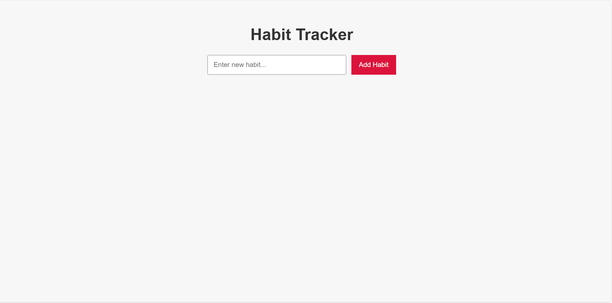
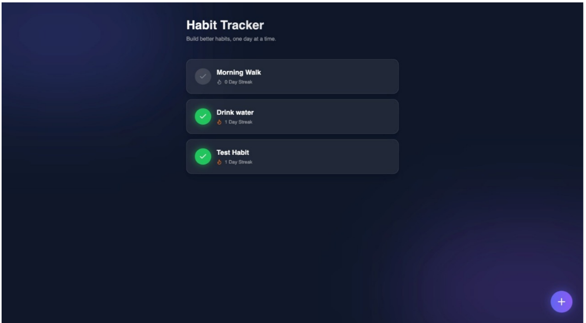

# 📘 Habits App – Full Documentation (README.md)

A complete Habit Tracking application built with **Node.js (Express)** for backend and **React + Vite** for frontend.  
The backend uses simple **file-based JSON storage** and provides full CRUD operations plus AI-based habit suggestions.

---

# 🚀 Features

### ✅ Backend (Node + Express)
- Create new habits  
- Delete habits  
- List all habits  
- Mark habit as completed  
- Track streak and last completed date  
- AI habit suggestion route  
- Stores data in `habits.json`  
- Support to add custom fields like `company`

### ✅ Frontend (React + Vite)
- Clean Vite template  
- Ready to integrate with backend  
- Components to be added: HabitForm, HabitList, HabitItem

---

# 📁 Project Structure

Backend/
└── src/
├── app.js
├── routes/
│ └── habits.js
├── utils/
│ └── llm.js
└── data/
└── habits.json

Frontend/
└── src/
├── App.jsx
├── main.jsx
└── (default Vite project)

yaml
Copy code

---

Create Habit (POST /habits)

Body:
{
"name": "Drink Water"
}

Response:
{
"id": "uuid",
"name": "Drink Water",
"streak": 0,
"lastCompleted": null
}

Get All Habits (GET /habits)

GET /habits

Complete Habit (PATCH /habits/:id/complete)

Updates:

streak increases by 1

lastCompleted becomes today’s date (YYYY-MM-DD)

Delete Habit (DELETE /habits/:id)

Response:
{
"message": "Habit deleted"
}

AI Habit Suggestions (POST /habits/suggest-habits)

Body:
{
"goal": "gain muscle"
}

Response:
{
"goal": "gain muscle",
"suggestions": ["habit1", "habit2"]
}

Habit Object Format

{
"id": "uuid",
"name": "Read Books",
"streak": 0,
"lastCompleted": null
}

Data Storage

Stored in:
src/data/habits.json

Add Company Field (optional)

POST route change:

const { name, company } = req.body;

const newHabit = {
id: uuidv4(),
name,
company: company || null,
streak: 0,
lastCompleted: null
};

Filter by company in GET:

if (req.query.company) {
habits = habits.filter(h => h.company === req.query.company);
}

Frontend Work Needed

You must create:

HabitForm.jsx

HabitList.jsx

HabitItem.jsx

Example API call:

await fetch("http://localhost:5000/habits
", {
method: "POST",
headers: { "Content-Type": "application/json" },
body: JSON.stringify({ name, company })
});

Run Backend

cd backend
npm install
node src/app.js

Make sure:
src/data/habits.json contains []

Run Frontend

cd frontend
npm install
npm run dev

API Example Commands

Create Habit:
curl -X POST http://localhost:5000/habits
 -H "Content-Type: application/json" -d "{"name":"Read Docs"}"

Get All:
curl http://localhost:5000/habits

Mark Completed:
curl -X PATCH http://localhost:5000/habits/
<id>/complete

Delete:
curl -X DELETE http://localhost:5000/habits/
<id>

AI Suggestions:
curl -X POST http://localhost:5000/habits/suggest-habits
 -H "Content-Type: application/json" -d "{"goal":"get fit"}"

 

